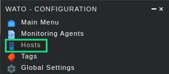
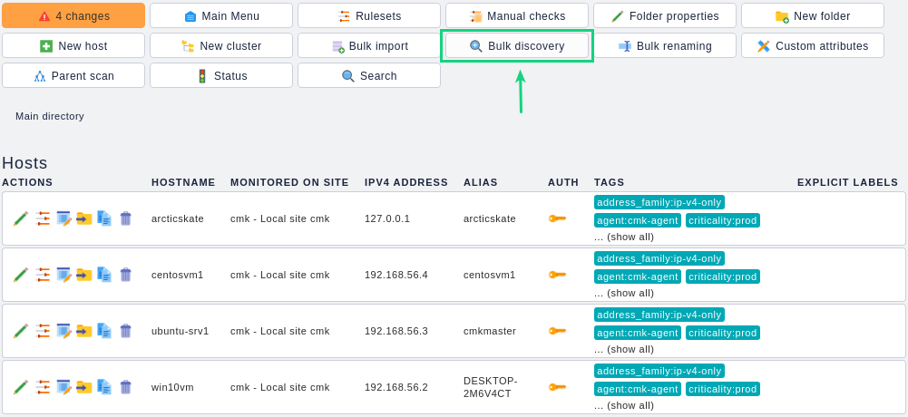
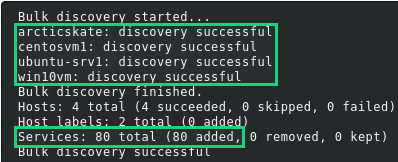
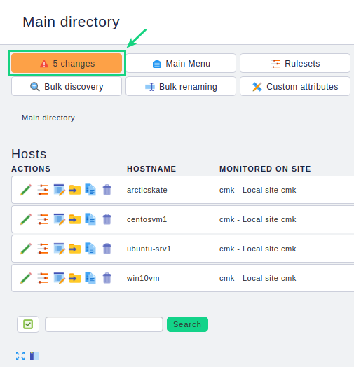
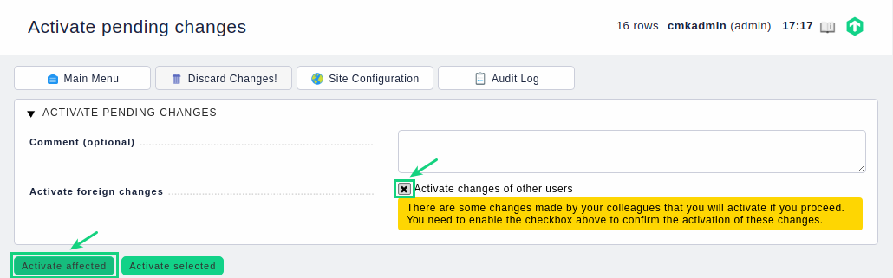
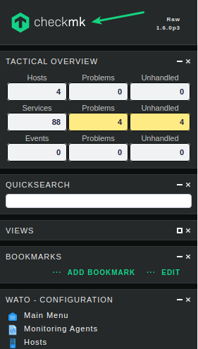
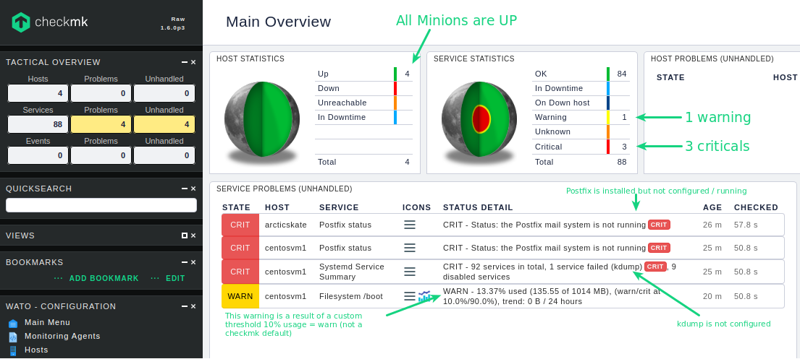

# Activate Minion Monitoring

Open your Browser and perform login to check**mk**

|          |                                     |
|----------|-------------------------------------|
| **URL**  |  http://`<IP MK Minion>`:8080/cmk   |
| **USER** |  cmkadmin                           |
| **PASSWORD** |  initial password (show docker logs) |
 

Click on the left sidebar on **WATO · Configuration** ->  "Hosts"

## Discover Monitoring Metrics (services)
Click on Bulk discovery

Start discovery with default settings
Click on Start ->

Check**mk** will now discover automatically  monitoring metrics (e.g. Filesystems, Network Interfaces, CPU, Memory, ... )

After successful discovery click on Back

## Activate Changes

Every configuration change in check**mk** (this includes changes by Salt and Web-API) will be tracked. Before the configuration will be effective you have to activate these changes.

The activation can be also done via Salt, but for a better understanding I like to demonstrated it in the Web Administration Tool (WATO)

## Monitor your Minions at glance

Open the Main Overview with a click on the "mk"

### Dashboard Overview Example

