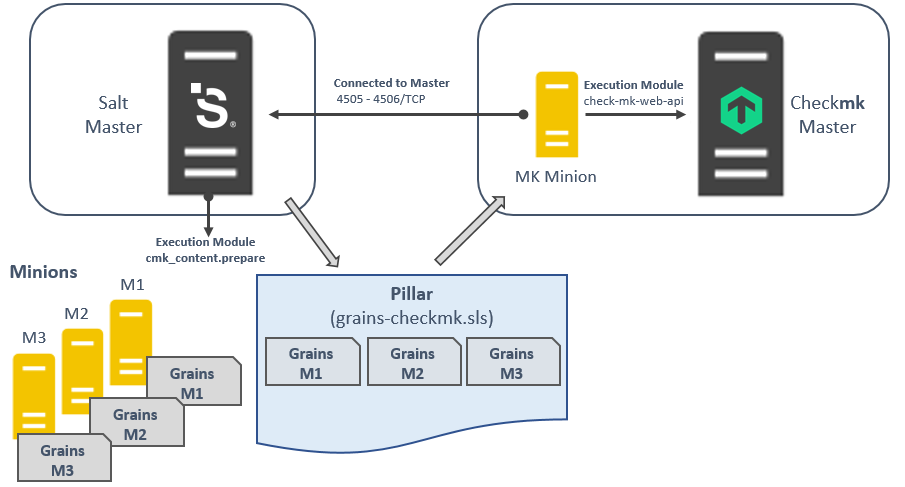
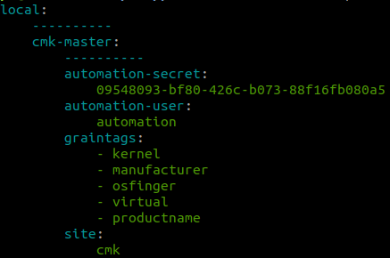

# Pillar & Grains
## Prerequisites  
- CMK Site is already running
- Test of check-mk-web-api Execution Module was successful
--- 

## Provide check**mk** Connection Data as Pillar

### Example:
```bash
cp /srv/formulas/salt-checkmk/pillar.example /srv/pillar/cmk-base.sls
```

Data structure:
```yaml
cmk-master:
  site: cmk
  port: 8080
  automation-user: automation
  automation-secret: <paste here the automation secret>
  graintags: ['kernel', 'manufacturer', 'osfinger', 'virtual', 'productname']
```
**Note**: Don't forget the replacement of the automation secret!

All Grains which are defined in graintags will be later on pushed to the cmk monitoring site and can be used there.

## Gather Grains from Minions


Gather grains from all minions that you plan to add to the monitoring site

```bash
salt-call cmk_content.prepare pillar_file=/srv/pillar/grains_for_checkmk.sls target="*" tgt_type=glob 
```
**Remark**:
In general I prefer salt-mine to get this job done, but cmk_content.prepare will also work fine in complex master-of-master setups.

## Assign Pillar to minion
Provide the data Minion (MK Minion) which communicates with the checkmk Master

Example:
vi /srv/pillar/top.sls

```yaml
base:
  '<your-MK-Minion>':
    - cmk-base
    - grains_for_checkmk
```
Test
```bash
salt your-MK-Minion pillar.items
```



---
|**Previous**||||**Next**|
|:-|-|-|-|-:|
| < [Getting Started](getting_started.md) ||^[Top](#pillar-&-grains)|| [Install check**mk** Agent via Salt](install_cmk_agent.md)>| 