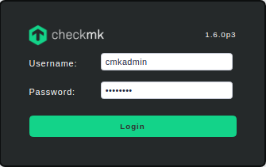
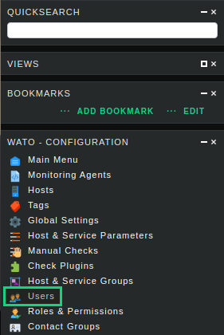
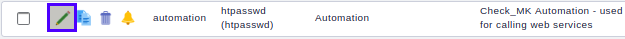

# Getting Started
## Prerequisites  
- Running Salt environment 
- Formula is added to your Salt environment [Salt docs formulas](https://docs.saltstack.com/en/latest/topics/development/conventions/formulas.html#adding-a-formula-as-a-gitfs-remote)

**Example to include Formula:**
```bash
mkdir -p /srv/formulas
cd /srv/formulas
git clone https://github.com/tribe29/salt-checkmk
```

```bash
cp /srv/formulas/salt-checkmk/files/salt-checkmk.conf /etc/salt/master.d/
systemctl restart salt-master.service
```

Please consider recommendations from SaltStack:
>We strongly recommend forking a formula repository 


## Components and Setup

| Component        | Description                    | 
|------------------|------------------------------- |
|Salt Master       |Master of all Minions           |
|check**mk** Master|Monitoring Master pulls monitoring data from check**mk** Agents| 
|MK Minion         |The Minion which hosts the check**mk** installation (container, installed package, e.g.)
|Minions           |All Minions connected to the Salt Master -> including the MK Minion|


This is only one of many possible setups to use Salt and checkmk.

To enable this setup:

1. Designate one of your minions as Host for the checkmk Master.
   (Recommendation: Linux based system)
2. Install checkmk on your minion. For example by running a docker container

https://hub.docker.com/r/checkmk/check-mk-raw

```bash
docker container run -dit -p 8080:5000 -v /omd/sites --name monitoring -v /etc/localtime:/etc/localtime --restart always checkmk/check-mk-raw:1.6.0-latest

#gather the logon credentials from container logs
docker logs -f <container id>
```
## Important Note
The Minion that hosts check**mk** is in this documentation marked as **MK Minion**.
Please replace in all examples the id < MK Minion > with the real Minion ID. 


## Connect Salt with check**mk**
Log into your check**mk** environment

Open your Browser and perform login to cmk container


|          |                                     |
|----------|-------------------------------------|
| **URL**  |  http://`<IP MK Minion>`:8080/cmk   |
| **USER** |  cmkadmin                           |
| **PASSWORD** |  initial password (show docker logs) |
 



Click on the left sidebar on **WATO · Configuration** ->  "Users"



Edit user `automation`:



Copy "Automation secret for machine accounts" (e.g. 7ffb0ff9-d907-4140-b95e-fb9d9df2a5)

## Test the Salt check-mk-web-api Module

```bash
salt <MK Minion> saltutil.sync_all

salt <MK Minion> check-mk-web-api.call method=get_all_users target=localhost cmk_site=cmk port=8080 cmk_user=automation cmk_secret=<paste here the automation secret>
```

---
|**Previous**|[Top](#getting-started)|**Next**|
|:-|-|-:|
| < [Readme](../README.md) || [Pillar & Grains](cmk_pillar_grains.md) >| 